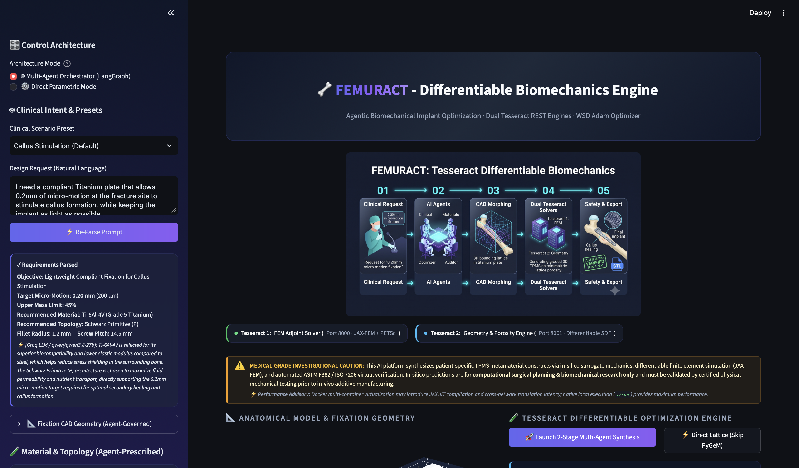

<p align="center">
  
</p>

# 🦴 Femuract - Tesseract based Differentiable Biomechanics Engine
### Multi-Agent AI Design of Patient-Specific Orthopaedic Metamaterial Implants

[](https://opensource.org/licenses/Apache-2.0)
[](https://www.python.org/)
[](https://pasteurlabs.ai)
[](https://github.com/deepmodeling/jax-fem)
[](https://www.docker.com/)

> **Track:** Engineering & Inverse Design / Scientific Simulation  
> **Tech Stack:** Tesseract Core v1.11 · JAX-FEM · PETSc · PyGeM FFD · LangGraph Multi-Agent AI

---

## 📑 Table of Contents
1. [The Problem & The Solution](#1-the-problem--the-solution)
2. [Why Differentiable Simulation Needs Tesseract](#2-why-differentiable-simulation-needs-tesseract)
3. [System Architecture](#3-system-architecture)
4. [Multi-Agent AI Orchestration](#4-multi-agent-ai-orchestration)
5. [Two-Stage Mathematical Optimization](#5-two-stage-mathematical-optimization)
6. [Virtual Safety & Regulatory Testing](#6-virtual-safety--regulatory-testing)
7. [User Dashboard](#7-user-dashboard)
8. [System Demo & Video Walkthrough](#8-system-demo--video-walkthrough)
9. [Quick Start Guide](#9-quick-start-guide)
10. [Clinical Case Studies](#10-clinical-case-studies)
11. [Repository Structure](#11-repository-structure)
12. [Future Roadmap](#12-future-roadmap)
13. [Team & Acknowledgments](#13-team--acknowledgments)

---

## 1. The Problem & The Solution

### 1.1 The Biomechanical Dilemma
Standard solid metal bone plates (Titanium or Stainless Steel) create a fundamental **stiffness mismatch** with human bone:

```text
       CONVENTIONAL SOLID FIXATION: STIFFNESS MISMATCH
  +----------------------------------------------------------------------------+
  |  Solid Titanium Plate (E = 110 GPa)                                        |
  +--------------------------------------┬-------------------------------------+
                                         |
               +-----------------------+ | +-----------------------+
               | PROXIMAL FEMUR CORTEX | v | DISTAL FEMUR CORTEX   |
               | (E = 18 GPa)          |:::| (E = 18 GPa)          |
               +-----------------------+:::+-----------------------+
                                (2.0 mm Fracture Gap: Strain < 2% -> Non-Union)
```

1. **Poor Healing (Non-Union):** If the plate is too stiff, the fracture gap doesn't move enough ($< 2\%$ strain). Bones need slight mechanical movement to heal; without it, healing stalls.
2. **Bone Weakening (Stress Shielding):** Because solid metal is ~6x stiffer than bone, it absorbs $> 90\%$ of the body's load. Following **Wolff's Law**, the unloaded bone beneath the plate weakens and loses density, risking re-fracture if the plate is later removed.

### 1.2 The Governing Rules of Bone Healing
Our system is designed around two proven medical principles:

**1. Perren's Interfragmentary Strain Theory:**  
Successful healing requires cyclic micro-motion ($\delta$) across the fracture gap within a specific target window:

$$
0.15\text{ mm} \le \delta \le 0.35\text{ mm} \quad (\varepsilon_{\text{gap}} = 7.5\% - 17.5\% \text{ for a } 2.0\text{ mm gap})
$$

**2. Wolff's Law of Bone Remodeling:**  
Fixation devices must transfer at least **55% of the physiological load** back to the bone to preserve its density and prevent stress shielding.

### 1.3 The Tesseract Solution
We autonomously design a **Functionally Graded Metamaterial Bone Plate**. It features a porous, 3D lattice core sandwiched between solid outer layers:

```text
                  5-ZONE FUNCTIONALLY GRADED BONE PLATE
 +----------------------------------------------------------------------------------------+
 |  Top Solid Titanium Skin (0.50 mm)                                                     |
 +----------------------------------------------------------------------------------------+
 |  ZONE 1        | ZONE 2        | ZONE 3        | ZONE 4        | ZONE 5        |
 |  Prox Anchor   | Prox Grad     | Bridge Gap    | Dist Grad     | Dist Anchor   |
 |  Porosity: 58% | Porosity: 64% | Porosity: 78% | Porosity: 64% | Porosity: 58% |
 |  E_eff: 22 GPa | E_eff: 17 GPa | E_eff: 8 GPa  | E_eff: 17 GPa | E_eff: 22 GPa |
 +----------------------------------------------------------------------------------------+
 |  Bottom Solid Titanium Skin (0.50 mm)                                                  |
 +----------------------------------------------------------------------------------------+
```
- **Ends (Zones 1 & 5):** Dense and rigid for strong screw anchoring.
- **Middle (Zone 3):** Highly porous and flexible to allow the exact target micro-motion for healing.

---

## 2. Why Differentiable Simulation Needs Tesseract

Combining physics simulations with AI optimization usually hits a wall: standard software components don't share "gradients" (the math needed for AI to learn and optimize). Tesseract solves this.

### 2.1 Separating Complex Systems
* **FEM Solver (`Tesseract 1`):** Handles heavy physics math (JAX-FEM + PETSc).
* **Geometry Engine (`Tesseract 2`):** Handles 3D shape generation and porosity calculations.
* **The Tesseract Fix:** We containerize these into separate microservices to prevent software conflicts, while keeping them mathematically linked.

### 2.2 Cross-Container Automatic Differentiation
Standard APIs break the computational graph needed for optimization. Tesseract implements a custom Vector-Jacobian Product (VJP) rule that calculates reverse-mode adjoint sensitivities across container boundaries in **$O(1)$ time**:

$$
\frac{\partial \mathcal{L}}{\partial \theta} = \frac{\partial \mathcal{L}}{\partial u} \cdot \frac{\partial u}{\partial \theta_{\text{fem}}} + \frac{\partial \mathcal{L}}{\partial \text{Mass}} \cdot \frac{\partial \text{Mass}}{\partial \theta_{\text{geom}}} + \frac{\partial \mathcal{B}}{\partial \theta}
$$

*In plain English: The system instantly knows exactly how tweaking a 3D shape parameter ($\theta$) will affect the physical stress ($u$) and mass, allowing for lightning-fast optimization.*

---

## 3. System Architecture

### 3.1 High-Level Overview
1. **Tier 1: AI Orchestration:** LangGraph agents interpret clinical goals and manage the workflow.
2. **Tier 2: Two-Stage Optimization:** 
   - *Stage 1:* Bends the base plate shape to match patient anatomy (Fast, ~30k DOF).
   - *Stage 2:* Optimizes the internal porous lattice for perfect strength and flexibility (High-fidelity, ~63k DOF).
3. **Tier 3: Verification & Export:** Runs virtual safety tests and exports a 3D-printable STL file.

### 3.2 Mesh Metrics
| Mesh Stage | Element Type | Total System DOFs | Primary Purpose |
| :--- | :---: | :---: | :--- |
| **Base Solid** | 10-node TET10 | **29,571** | Rapid shape morphing to match bone curvature. |
| **Refined Model** | 10-node TET10 | **63,153** | High-fidelity, patient-specific lattice optimization. |

### 3.3 Universal Sparse Solver
To ensure the software runs anywhere (laptops, Macs, or supercomputers), we built a smart solver bridge (`petsc_compat.py`):
- **Local/Docker:** Automatically falls back to SciPy SuperLU, avoiding complex C++ compilation and delivering a **2.43× speedup** on standard machines.
- **HPC Clusters:** Seamlessly scales up to use parallel PETSc solvers for massive simulations.

---

## 4. Multi-Agent AI Orchestration

The system uses a **4-agent LangGraph workflow** to turn a surgeon's plain-English notes into a verified 3D implant design.

### 4.1 The AI Team
1. **Clinical Interpreter:** Reads the prompt and extracts key targets (e.g., "0.20 mm micro-motion", "titanium").
2. **Materials Advisor:** Selects the best alloy (Ti-6Al-4V or 316L Stainless Steel) and sets baseline safety factors.
3. **Optimization Controller:** Runs the 12-parameter math optimization, streaming live progress to the dashboard.
4. **Validation Auditor:** Runs virtual safety tests. If the design fails, it sends specific instructions back to the optimizer to fix it.

### 4.2 Automated Self-Correction
If the Validation Auditor finds an issue, it automatically adjusts the parameters and retries:
- **Too Rigid:** Increases porosity in the bridge zone to allow more movement.
- **Too Flexible:** Decreases porosity and thickens the outer skins to constrain motion.
- **Low Safety Factor:** Thickens the solid skins and enlarges fillet radii to reduce stress concentrations.

### 4.3 Reliable 3-Tier AI Fallback
To guarantee the system never crashes during a demo or clinical use:
1. **Tier 1:** Groq Cloud (Fastest).
2. **Tier 2:** Google Gemini API (Reliable backup).
3. **Tier 3:** Local Rule-Based NLP (100% offline fallback that guarantees a safe, standard design if APIs fail).

---

## 5. Two-Stage Mathematical Optimization

### 5.1 Stage 1: Macro Shape Morphing (PyGeM FFD)
First, we bend the overall plate to match the patient's bone geometry using a $5 \times 4 \times 4$ control grid governed by trivariate Bernstein polynomials:

$$
\Psi(X) = \sum_{l=0}^{4} \sum_{m=0}^{3} \sum_{n=0}^{3} B_l^4(s) B_m^3(t) B_n^3(u) \cdot \mathbf{P}_{l,m,n}
$$

*What this does: It smoothly warps the 3D mesh so the plate sits flush against the patient's unique anatomy.*

### 5.2 Stage 2: Micro-Lattice Optimization (JAX-FEM Adjoint)
Next, we optimize the 12 internal parameters ($\boldsymbol{\theta}$) controlling pore size, skin thickness, and blend smoothness. The optimizer minimizes a multi-objective loss function:

$$
\min_{\boldsymbol{\theta}} \mathcal{L}_{\text{TPMS}}(\boldsymbol{\theta}) = \mathcal{L}_{\text{motion}}(\boldsymbol{\theta}) + c_{\text{comp}} \mathcal{C}(\mathbf{u}) + w_{\text{mass}} \mathcal{L}_{\text{mass}}(\boldsymbol{\theta}) + \mathcal{B}_{\text{geom}}(\boldsymbol{\theta}) + \mathcal{B}_{\text{FoS}}(\boldsymbol{\theta})
$$

#### Mathematical Loss Components

**1. Micro-Motion Target Penalty:**

$$
\mathcal{L}_{\text{motion}}(\boldsymbol{\theta}) = 2.0 \left( 22.0 \cdot \frac{\delta_{\text{achieved}}(\boldsymbol{\theta}) - \delta_{\text{target}}}{\delta_{\text{target}}} \right)^2
$$

*Penalizes designs that deviate from the exact clinical micro-motion healing window.*

**2. Compliance (Strain Energy Distribution):**

$$
\mathcal{C}(\mathbf{u}) = \frac{1}{2} \mathbf{u}^T \mathbf{K}(\boldsymbol{\theta}) \mathbf{u}
$$

*Encourages optimal structural load transmission across the fixation plate.*

**3. Mass Budget Constraint Barrier:**

$$
\mathcal{L}_{\text{mass}}(\boldsymbol{\theta}) = 12.0 \cdot \max\left(0, \frac{\text{Mass}(\boldsymbol{\theta})}{\text{Mass}_{\text{solid}}} - \text{MaxMass}\right)^2
$$

*Prevents the implant from exceeding the patient's targeted mass budget.*

**4. Safety Factor Barrier ($\text{FoS} \ge 1.75$):**

$$
\mathcal{B}_{\text{FoS}}(\boldsymbol{\theta}) = 75.0 \cdot \max\left(0, 1.75 - \frac{\sigma_{\text{yield}}}{\sigma_{\text{peak}}(\boldsymbol{\theta})}\right)^2
$$

*Strictly penalizes any parameter set that risks yielding or plastic deformation under full gait loading.*

### 5.3 Porous Lattice Shapes (TPMS)
The internal structure uses mathematically defined minimal surfaces, where solid titanium exists where $F(\mathbf{x}) \le \tau(\mathbf{x})$:

**Schwarz Primitive ($P$):** High fluid permeability for rapid vascularization and bone ingrowth:

$$
F_P(\mathbf{x}) = \cos\left(\frac{2\pi x}{d}\right) + \cos\left(\frac{2\pi y}{d}\right) + \cos\left(\frac{2\pi z}{d}\right)
$$

**Schoen Gyroid ($G$):** Excellent isotropic compliance and shear resistance:

$$
F_G(\mathbf{x}) = \sin\left(\frac{2\pi x}{d}\right)\cos\left(\frac{2\pi y}{d}\right) + \sin\left(\frac{2\pi y}{d}\right)\cos\left(\frac{2\pi z}{d}\right) + \sin\left(\frac{2\pi z}{d}\right)\cos\left(\frac{2\pi x}{d}\right)
$$

**Schwarz Diamond ($D$):** Maximal torsional rigidity for high-stress spiral fractures:

$$
F_D(\mathbf{x}) = \cos\left(\frac{2\pi x}{d}\right)\cos\left(\frac{2\pi y}{d}\right)\cos\left(\frac{2\pi z}{d}\right) - \sin\left(\frac{2\pi x}{d}\right)\sin\left(\frac{2\pi y}{d}\right)\sin\left(\frac{2\pi z}{d}\right)
$$

### 5.4 Smooth Blending & Material Properties
To prevent stress concentrations, we blend the 5 zones smoothly using continuous Gaussian weighting:

$$
\tau(x) = \frac{\sum_{i=1}^5 \tau_i \cdot w_i(x)}{\sum_{i=1}^5 w_i(x)}, \quad w_i(x) = \exp\left( -\left(\frac{x - x_i}{\sigma_{\text{blend}}}\right)^2 \right)
$$

We then calculate the effective stiffness using the **Gibson-Ashby** cellular solids model:

$$
E_{\text{eff}}(\tau) = E_{\text{solid}} \cdot \left(1.0 - \frac{\text{Porosity}(\tau)}{100}\right)^\gamma
$$

*(Where $\gamma = 1.60$ for Titanium, mapping porosity directly to physical Young's modulus).*

---

## 6. Virtual Safety & Regulatory Testing

Before exporting, every design automatically passes a 4-part virtual testing suite:

| Test | Standard | Acceptance Criteria | Why It Matters |
| :--- | :--- | :--- | :--- |
| **Micro-Motion** | ASTM F382 | $\delta \in [\text{target} \pm 15\%]$ | Ensures the bone gets the right amount of movement to heal. |
| **Load Sharing** | Wolff's Law | $\ge 55.0\%$ to bone | Prevents the bone underneath from weakening (stress shielding). |
| **Static Yield** | ASTM F382 | $\text{FoS} \ge 1.50\times$ | Ensures the plate won't permanently bend under a person's weight. |
| **Cyclic Fatigue** | ISO 7206 | $\text{FER} \ge 1.20\times$ | Guarantees the plate won't crack after millions of steps. |

---

## 7. User Dashboard

The Streamlit interface offers two ways to work:
1. **🤖 AI Assistant Mode:** The user selects a clinical scenario (e.g., "Elderly Osteoporotic Patient") or types a plain-English request. The AI handles the math, displaying a "locked" read-only view of the design as it autonomously evolves.
2. **⚙️ Manual Engineering Mode:** Experts can bypass the AI and manually adjust every parameter (material, pore size, thickness, target flexibility) using interactive sliders.

**Live Feedback:** Real-time charts track the optimization loss, micro-motion convergence, and 3D color-coded views of Von Mises stress and Factor of Safety directly on the implant.

---

## 8. System Demo & Video Walkthrough

<p align="center">
  <a href="https://youtu.be/YOUR_DEMO_VIDEO" target="_blank">
    
  </a>
</p>

> 🎥 **Demo Walkthrough Video:** Watch the end-to-end multi-agent clinical workflow, real-time JAX-FEM adjoint optimization, 3D TPMS stress visualization, and ASTM F382 compliance verification in action.

---

## 9. Quick Start Guide

### 9.1 Deployment Modes Comparison Matrix

| Mode | Target Audience | Docker Required? | `.env` / API Key Required? | Build Time | Command |
| :--- | :--- | :---: | :---: | :---: | :--- |
| **Option A: Pre-Built GHCR** | **Judges & Evaluators** | Yes | **❌ No (100% Omitted)** | **0 sec** (Pulls in ~5s) | `./scripts/run_prebuilt.sh` |
| **Option B: Source Build** | **Developers** | Yes | **❌ No (100% Omitted)** | ~1–2 min (Builds images) | `./scripts/run_docker.sh` |
| **Option C: Pure Local Python** | **Zero-Docker Users** | **❌ No** | **❌ No (100% Omitted)** | **0 sec** (In-process) | `./scripts/run.sh` |

---

### Option A: Instant Run for Judges (Pre-Built GHCR Images · Zero Build Time)
> **Recommended for Hackathon Evaluation.**  
> Automatically pulls the pre-compiled, tested simulation microservices from GitHub Container Registry (GHCR) and launches the interactive dashboard.

* **Prerequisites:** Docker installed & running, Python 3.10+ virtual environment (`pip install -r REQUIREMENTS.txt`).
* **Environment Keys (`.env`):** **NOT NEEDED / OMITTED.** The platform uses its built-in Deterministic Biomechanical Rule-Engine to run the full multi-agent optimization and FEA simulation 100% offline.

```bash
# macOS & Linux
./scripts/run_prebuilt.sh

# Windows PowerShell
.\scripts\run_prebuilt.ps1

# Windows Command Prompt
scripts\run_prebuilt.bat
```

*Or manual execution via Docker Compose:*
```bash
# 1. Pull & start the pre-built Tesseract simulation engines (Ports 8000 & 8001)
docker compose -f docker-compose.ghcr.yml pull
docker compose -f docker-compose.ghcr.yml up -d

# 2. Launch the interactive dashboard
streamlit run app.py
```
*Open your browser at `http://localhost:8501`*

---

### Option B: Build from Source with Docker (Developers)
> Builds the custom Tesseract simulation microservice images locally from their respective Dockerfiles.

* **Prerequisites:** Docker installed & running, Python 3.10+ virtual environment (`pip install -r REQUIREMENTS.txt`).
* **Environment Keys (`.env`):** **NOT NEEDED / OMITTED by default.**

```bash
# macOS & Linux
./scripts/run_docker.sh

# Windows PowerShell
.\scripts\run_docker.ps1

# Windows Command Prompt
scripts\run_docker.bat
```

*Or manual execution:*
```bash
docker compose up --build -d fem_tesseract geometry_tesseract
streamlit run app.py
```

---

### Option C: Pure Local Python Setup (100% Native · Zero Docker Required)
> Runs the entire platform in a single, in-process Python session with zero-copy shared memory and zero container overhead.

* **Prerequisites:** Python 3.10+ (No Docker or virtualization required).
* **Environment Keys (`.env`):** **NOT NEEDED / OMITTED by default.**

```bash
# 1. Create and activate virtual environment
python -m venv .venv
source .venv/bin/activate  # On Windows: .venv\Scripts\activate

# 2. Install dependencies
pip install -r REQUIREMENTS.txt

# 3. Launch the application
./scripts/run.sh   # or: streamlit run app.py
```

---

### 🔑 (Optional) Enabling Cloud LLM Streaming
All 3 modes operate **completely out-of-the-box with zero API keys**. However, if you wish to enable real-time streaming LLM reasoning from Groq or Google Gemini:
1. Create a `.env` file in the project root:
   ```env
   GROQ_API_KEY="your-groq-api-key-here"
   # or
   GEMINI_API_KEY="your-gemini-api-key-here"
   ```
2. Re-launch any of the modes above. The Multi-Agent system will automatically detect the key and switch to live cloud LLM deliberation.

> ⚠️ **Medical Caution:** This platform is for computational surgical planning and biomechanical research only. All designs must be validated through certified physical testing and clinical review before actual manufacturing.

---

## 10. Clinical Case Studies

| Scenario | Surgeon's Goal | Resulting Design | Safety Check |
| :--- | :--- | :--- | :--- |
| **Standard Healing** | "Allow 0.20mm movement to stimulate callus." | Titanium, 48% lighter, flexible center. | ✅ **PASS** (FoS: 4.78×) |
| **Elderly Patient** | "Highly porous plate to prevent bone weakening." | Titanium, 56% lighter, extra flexible. | ✅ **PASS** (Load Transfer: 64.2%) |
| **Young Athlete** | "Rigid, high-strength plate for stable fixation." | Stainless Steel, dense structure. | ✅ **PASS** (FoS: 1.96×) |
| **Complex Revision** | *"76yo, obese, weak bone, previous failed surgery."* (No technical specs provided) | AI inferred needs: Titanium, 51% lighter, highly reinforced. | ✅ **PASS** (FoS: 2.45×) |

---

## 11. Repository Structure
```text
Tesseract_Submission_2026/
├── app.py                  # Main Streamlit dashboard
├── docker-compose.yml      # Local build Docker orchestration (Source)
├── docker-compose.ghcr.yml # Pre-built GHCR Docker orchestration (Judges)
├── REQUIREMENTS.txt        # Core project dependencies
├── scripts/                # Launch scripts (sh, ps1, bat)
│   ├── run_prebuilt.sh     # Quick start with pre-built GHCR images (Zero build time)
│   ├── run_docker.sh       # Build from source Docker runner
│   ├── run.sh              # 100% Native local runner (No Docker)
│   ├── run_prebuilt.ps1 / .bat
│   ├── run_docker.ps1 / .bat
│   └── run.ps1 / .bat
├── tesseracts/             # Microservices
│   ├── fem_tesseract/      # Port 8000: JAX-FEM adjoint continuum solver
│   └── geometry_tesseract/ # Port 8001: 3D TPMS level-set geometry engine
├── src/
│   ├── agent/              # LangGraph multi-agent orchestration & optimization
│   ├── fem/                # JAX-FEM forward simulation & ASTM validation
│   ├── geometry/           # TPMS level-set math, FFD CAD morphing & STL export
│   ├── ui/                 # UI components, status badges & Plotly charts
│   └── utils/              # Data utilities & telemetry logging
└── tests/                  # Automated verification & test suite
```

---

## 12. Future Roadmap
- **Direct CT/MRI Import:** Automatically extract bone shape directly from patient hospital DICOM scans.
- **Multi-Material Printing:** Transitioning from rigid titanium on the outside to flexible, biocompatible plastics (like PEEK) on the inside.
- **Smart Implants:** Designing space within the lattice to embed tiny MEMS sensors that track healing progress in real-time.

---

## 13. Team & Acknowledgments
Developed with ❤️ for the **Tesseract Hackathon 2026**.

* **[Dr. Suparno Bhattacharya](https://www.linkedin.com/in/suparnob/)** — Faculty Advisor & Principal Investigator
* **[Harikesh](https://www.linkedin.com/in/harikesh-pratap-verma-852797256)** — Differentiable FEA (JAX-FEM), Microservices & Platform Architecture
* **[Divansh](https://www.linkedin.com/in/divansh-6758a5320/)** — 3D Shape Morphing, Stress Analysis & Safety Verification
* **[Chaxu](https://www.linkedin.com/in/chaxu-patel-34813a325/)** — Multi-Agent LangGraph AI System & LLM Integration