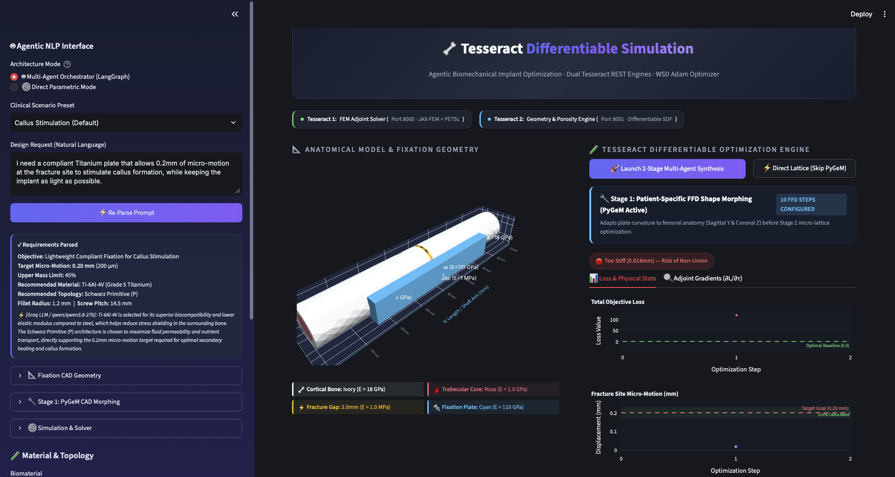

<p align="center">
  
</p>

# 🦴 Tesseract Differentiable Biomechanics
### Multi-Agent Inverse Design of Patient-Specific Orthopaedic Metamaterial Implants via Differentiable Finite Element Simulation

[](https://opensource.org/licenses/Apache-2.0)
[](https://www.python.org/)
[](https://pasteurlabs.ai)
[](https://github.com/deepmodeling/jax-fem)
[](https://www.docker.com/)

> **Track Submission:** Engineering & Inverse Design / Scientific Simulation & Inverse Problems  
> **Platform Version:** Tesseract Core v1.11 · JAX-FEM · PETSc · PyGeM FFD · LangGraph Multi-Agent Orchestrator

---

## 📑 Table of Contents

1. [Executive Summary & The Biomechanical Dilemma](#1-executive-summary--the-biomechanical-dilemma)
2. [Why Differentiable Simulation Needs Tesseract](#2-why-differentiable-simulation-needs-tesseract)
3. [End-to-End System Architecture](#3-end-to-end-system-architecture)
4. [Multi-Agent LangGraph AI Orchestration Engine](#4-multi-agent-langgraph-ai-orchestration-engine)
5. [Two-Stage Multi-Scale Mathematical Optimization Pipeline](#5-two-stage-multi-scale-mathematical-optimization-pipeline)
6. [Automated In-Silico Verification & Regulatory Testing Suite](#6-automated-in-silico-verification--regulatory-testing-suite)
7. [User Interface & Real-Time Engineering Dashboard](#7-user-interface--real-time-engineering-dashboard)
8. [Quick Start & Deployment Guide](#8-quick-start--deployment-guide)
9. [Clinical Case Studies & Experimental Benchmarks](#9-clinical-case-studies--experimental-benchmarks)
10. [Repository Directory Map](#10-repository-directory-map)
11. [Future Roadmap & Translational Horizons](#11-future-roadmap--translational-horizons)
12. [Research Team & Institutional Acknowledgments](#12-research-team--institutional-acknowledgments)
13. [References & Scientific Literature](#13-references--scientific-literature)

---

## 1. Executive Summary & The Biomechanical Dilemma

### 1.1 Clinical Motivation
Diaphyseal femur fractures are among the most debilitating orthopaedic trauma injuries worldwide, requiring surgical internal fixation with bone plates and cortical screws. However, conventional solid titanium plates ($E = 110\text{ GPa}$) or stainless steel plates ($E = 200\text{ GPa}$) present a fundamental **biomechanical paradox**:

```text
       CONVENTIONAL SOLID FIXATION: STIFFNESS MISMATCH & CLINICAL COMPLICATIONS
  +----------------------------------------------------------------------------+
  |  Solid Titanium Plate (E = 110 GPa)                                        |
  |  [Screw 1]     [Screw 2]            [EXCESS RIGIDITY]     [Screw 3]    [Screw 4]  |
  +--------------------------------------┬-------------------------------------+
                                         |
               +-----------------------+ | +-----------------------+
               | PROXIMAL FEMUR CORTEX | v | DISTAL FEMUR CORTEX   |
               | (E = 18 GPa)          |:::| (E = 18 GPa)          |
               +-----------------------+:::+-----------------------+
                                (2.0 mm Fracture Gap: Strain < 2% -> Non-Union)
```

1. **Fixation Rigidity & Non-Union:** If the fixation construct is overly stiff, interfragmentary strain is suppressed below the biological activation threshold ($< 2\%$, corresponding to micro-motion $< 0.08\text{ mm}$). Osteoblasts receive no mechanical stimulus, leading to delayed union, fibrous non-union, and hardware failure.
2. **Stress Shielding & Cortical Osteopenia:** Because solid metal is $6\times$ stiffer than cortical bone ($E = 18\text{ GPa}$), it carries $> 90\%$ of the physiological ambulatory gait load ($750\text{ N}$). According to **Wolff's Law**, the unloaded bone undergoes progressive bone resorption and localized osteoporosis under the plate. When the implant is surgically removed 12–18 months later, the thinned cortex frequently suffers catastrophic secondary refracture.

### 1.2 Perren's Strain Theory & Wolff's Law
Modern biomechanical osteosynthesis relies on two governing physiological principles:

* **Perren's Interfragmentary Strain Theory:** Successful secondary fracture healing through periosteal callus formation requires cyclic axial micro-motion $\delta$ across the fracture gap within a narrow physiological target window:

$$
0.15\text{ mm} \le \delta \le 0.35\text{ mm} \quad (\varepsilon_{\text{gap}} = 7.5\% - 17.5\% \text{ for a } 2.0\text{ mm gap})
$$

* **Wolff's Law of Bone Remodeling:** Living bone adapts its internal trabecular and cortical architecture in response to mechanical stresses. Fixation devices must transfer at least **$55\%$ of the physiological load** through the cortical bone column to preserve bone density.

### 1.3 The Proposed Solution: Functionally Graded TPMS Plates
This platform autonomously synthesizes a **Functionally Graded Metamaterial Bone Plate** featuring a continuous 5-zone Triply Periodic Minimal Surface (TPMS) porous core sandwiched between solid cortical and muscle-facing titanium skins:

```text
                  INVERSELY DESIGNED 5-ZONE FUNCTIONALLY GRADED BONE PLATE
 +----------------------------------------------------------------------------------------+
 |  Top Solid Titanium Skin (0.50 mm)                                                     |
 +----------------------------------------------------------------------------------------+
 |  ZONE 1        | ZONE 2        | ZONE 3        | ZONE 4        | ZONE 5        |
 |  Prox Anchor   | Prox Grad     | Bridge Gap    | Dist Grad     | Dist Anchor   |
 |  Porosity: 58% | Porosity: 64% | Porosity: 78% | Porosity: 64% | Porosity: 58% |
 |  E_eff: 22 GPa | E_eff: 17 GPa | E_eff: 8 GPa  | E_eff: 17 GPa | E_eff: 22 GPa |
 +----------------------------------------------------------------------------------------+
 |  Bottom Solid Titanium Skin (0.50 mm)                                                  |
 +----------------------------------------------------------------------------------------+
            ^                                      ^                                      ^
     Rigid Screw Anchor                    Compliant Flexural Bridge              Rigid Screw Anchor
   (High Pullout Strength)                 (Target 0.20 mm Callus Motion)       (High Pullout Strength)
```

---

## 2. Why Differentiable Simulation Needs Tesseract

Integrating non-linear structural continuum physics with analytical level-set implicit geometry and AI agents presents three fundamental engineering bottlenecks that **Tesseract Core** uniquely resolves:

```text
Traditional Isolated Stack:                 Tesseract Differentiable Composition:
+-------------------------+                 +------------------------------------------+
|  Compiled C++ FEM       |                 |              TESSERACT CORE              |
|  (Gmsh + SuperLU)       |                 |                                          |
+------------┬------------+                 |  +------------------+  +---------------+ |
             | [Optimization Barrier]       |  | Tesseract 1: FEM |<-| Tesseract 2:  | |
             v                              |  | (JAX-FEM+PETSc)  |  | Geometry SDF  | |
+-------------------------+                 |  +--------┬---------+  +-------┬-------+ |
|  Level-Set Geometry     |                 |           +--------┬-----------+         |
|  (Python Marching Cubes)|                 |                    v                     |
+-------------------------+                 |   Continuous Reverse-Mode Adjoint (VJP)  |
  No Network Adjoint Gradients              |             dL/dtheta over REST          |
                                            +------------------------------------------+
```

### 2.1 Heterogeneous Backend Decoupling
* **FEM Structural Solver (`Tesseract 1`):** Requires compiled C/C++ sparse direct factorizations (SciPy SuperLU), Gmsh mesh topology, and JAX numerical linear algebra.
* **Geometry Engine (`Tesseract 2`):** Requires analytical implicit minimal surface evaluations, Bernstein polynomial tensor products, and 3D Marching Cubes.
* **Tesseract Encapsulation:** By containerizing these environments into isolated REST microservices, Tesseract eliminates Python library dependency conflicts and enables zero-overhead horizontal scaling.

### 2.2 Cross-Container Reverse-Mode Automatic Differentiation
Standard microservices create an optimization barrier: HTTP payloads cannot transmit computational graph tapes. Tesseract's `apply_tesseract()` implements a custom Vector-Jacobian Product (VJP) rule across container boundaries, evaluating reverse-mode adjoint sensitivities in **$O(1)$ time**:

$$
\frac{\partial \mathcal{L}}{\partial \theta} = \frac{\partial \mathcal{L}}{\partial u} \cdot \frac{\partial u}{\partial \theta_{\text{fem}}} + \frac{\partial \mathcal{L}}{\partial \text{Mass}} \cdot \frac{\partial \text{Mass}}{\partial \theta_{\text{geom}}} + \frac{\partial \mathcal{B}}{\partial \theta}
$$

### 2.3 Dual Microservices Architecture (Ports 8000 & 8001)
1. **Port 8000 — FEM Adjoint Microservice (`fem_tesseract`):** Evaluates tetrahedral finite element elasticity, solves $K(\theta) u = f$, and returns structural compliance $\mathcal{C}(u)$ and nodal displacements $u$.
2. **Port 8001 — Geometry & Porosity Microservice (`geometry_tesseract`):** Evaluates the 12-DOF level-set signed distance field (SDF), computes exact mass fraction $\text{Mass}(\theta)$, and enforces geometric boundary bounds.

---

## 3. End-to-End System Architecture

### 3.1 Multi-Tier Architecture Diagram

```text
+----------------------------------------------------------------------------------------+
| TIER 1: MULTI-AGENT STATE GRAPH ORCHESTRATION (LangGraph State Machine)               |
|                                                                                        |
|   [*] Clinical Interpreter      [*] Materials Advisor       [*] Optimization Control   |
|    - Perren's Strain Target      - Alloy Selection (Ti/SS)   - 12-DOF WSD Adam Loop    |
|                                                                                        |
|   [*] Validation Auditor (Autonomous Closed-Loop Self-Correction State Machine)        |
+-------------------------------------------┬--------------------------------------------+
                                            |
                                            v
+----------------------------------------------------------------------------------------+
| TIER 2: DUAL-STAGE MULTI-SCALE OPTIMIZATION PIPELINE                                   |
|                                                                                        |
|  STAGE 1: Fast Macro CAD Shape Morphing (PyGeM FFD on 30k DOF Base Mesh)               |
|   - 5x4x4 Bernstein Free-Form Deformation Control Grid (morphs plate curvature to bone)|
|   - Finite-difference Adam gradient steps on 29,571 DOF base mesh                      |
|                                                                                        |
|  STAGE 2: Differentiable JAX-FEM Lattice Synthesis (Remeshed 63k DOF Refined Mesh)     |
|   - Morph coordinates transferred to 2.14x refined mesh (21,051 nodes, 63,153 DOFs)   |
|   - Tesseract 1 (Port 8000): JAX-FEM + SuperLU (13,190 TET10 Cells, 63,153 DOFs)      |
|   - Tesseract 2 (Port 8001): Analytical Level-Set SDF & Porosity Engine                |
|   - Direct Mode: One-click option to skip Stage 1 and run directly on refined mesh     |
+-------------------------------------------┬--------------------------------------------+
                                            |
                                            v
+----------------------------------------------------------------------------------------+
| TIER 3: IN-SILICO VERIFICATION, 3D VISUALIZATION & ADDITIVE MANUFACTURING EXPORT       |
|  - Automated In-Silico Battery: ASTM F382 Micro-Motion, Static FoS, ISO 7206 Fatigue   |
|  - Interactive 3D Plotly Renders: Metamaterial Porosity, Von Mises Stress, FoS Field   |
|  - Additive Manufacturing Export: Conformal 3D-Printable Binary STL Export Engine      |
+----------------------------------------------------------------------------------------+
```

### 3.2 Multi-Grid Discretization & Mesh Metrics Table
To balance rapid interactive execution during macro CAD morphing with clinical precision during lattice optimization, the platform employs a multi-grid discretization strategy:

| Mesh Stage | Mesh Filename | Element Type | Quadratic Nodes | Total System DOFs | Quadratic Elements | Primary Purpose |
| :--- | :--- | :---: | :---: | :---: | :---: | :--- |
| **Base Solid** | `model.msh` | 10-node TET10 | 9,857 | **29,571** | 5,951 | Rapid finite-difference FFD shape morphing |
| **Refined Model** | `refined_model.msh` | 10-node TET10 | 21,051 | **63,153** | 13,190 | High-fidelity patient-specific anatomical base |
| **Morphed Refined** | `morphed_model.msh` | 10-node TET10 | 21,051 | **63,153** | 13,190 | Differentiable JAX-FEM adjoint lattice optimization |

#### Gmsh Physical Group Discretization Tags:
* **Tag 1 & 3:** Proximal & Distal Femur Cortical Bone ($E = 18\text{ GPa}, \nu = 0.30$)
* **Tag 2 & 4:** Proximal & Distal Cancellous Trabecular Core ($E = 1\text{ GPa}, \nu = 0.30$)
* **Tag 5:** 2.0 mm Fracture Gap Callus Zone ($E = 1\text{ MPa}, \nu = 0.40$)
* **Tag 6:** Fracture Gap Margin Line
* **Tag 10:** Fixation Implant Plate Construct ($E = 110\text{ GPa}, \nu = 0.32$)

---

## 4. Multi-Agent LangGraph AI Orchestration Engine

The clinical reasoning layer is powered by a **4-agent LangGraph state machine** that transforms unstructured natural language prompts from orthopaedic surgeons into verified 3D CAD implants:

```text
                  LANGGRAPH STATE MACHINE & RECURSIVE ROUTING TOPOLOGY
                  
  Surgeon Prompt ---> [ Clinical Interpreter ]
                              |
                              v
                     [ Materials Advisor ]
                              |
                              v
              +-----> [ Optimization Controller ] <-------+
              |                | (12-DOF JAX-FEM Loop)    |
              |                v                          |
              |      [ Validation Auditor ]               |
              |                |                          |
              |                v                          |
              |         Passes In-Silico?                 |
              |         /             \                   |
    Adjusted  |     NO (Retry)     YES (Finalize)         | Parameter
    Weights   |       /                 \                 | Tightening
              +------┴                   v                |
                                [ Binary STL Export ] ----+
```

### 4.1 Specialist Agent Personas
1. **Clinical Interpreter Node:** Ingests clinical prompts and extracts patient age, bone mineral density status, fracture gap geometry, target interfragmentary displacement $\delta_{\text{target}}$ ($0.15 - 0.35\text{ mm}$), and clinical rationale.
2. **Materials Advisor Node:** Selects optimal biomaterial alloy (`Ti-6Al-4V Grade 5 Titanium` vs `316L Stainless Steel`), setting the Gibson-Ashby modulus exponent $\gamma$ ($1.60$ for Ti, $1.55$ for SS), yield strength $\sigma_{\text{yield}}$ ($880\text{ MPa}$ vs $290\text{ MPa}$), and minimum Factor of Safety targets.
3. **Optimization Controller Node:** Configures the 12-DOF Warmup-Stable-Decay (WSD) Adam optimizer, streaming live telemetry (`loss`, `frac_disp`, `porosity`, `gradients`) to the UI via thread-safe callbacks.
4. **Validation Auditor Node:** Executes the automated 4-point ASTM F382 and ISO 7206 virtual testing battery, routing execution for autonomous self-correction if metrics deviate from regulatory bounds.

### 4.2 Autonomous Closed-Loop Self-Correction State Machine
If the Validation Auditor detects micro-motion out-of-bounds or an insufficient Factor of Safety ($\text{FoS} < 1.50\times$), it executes autonomous parameter corrections:
* **Micro-motion too rigid ($\delta < \delta_{\text{target}} - 20\%$):** Increases bridge TPMS threshold $\tau_{\text{bridge}}$ (increases compliance) and widens working bridge span $L_{\text{bridge}}$.
* **Micro-motion excessive ($\delta > \delta_{\text{target}} + 20\%$):** Thickens top/bottom solid skins ($t_{\text{top}}, t_{\text{bot}}$) and densifies anchor zones.
* **FoS Warning ($\text{FoS} < 1.50\times$):** Increases corner fillet radius $r_{\text{fillet}}$ and boosts mass fraction penalty weight $w_{\text{mass}}$.

### 4.3 Tri-Tier Robust LLM Fallback Mechanism (Groq → Gemini → Regex NLP)
To ensure **100% operational reliability** during hackathon judging and clinical use, the platform implements a robust, non-blocking 3-tier fallback architecture:

```text
  [ Surgeon Prompt ]
          |
          v
  1. Groq Cloud Engine -----------> (Success) --> Parsed Design Request
          | (404/429/Timeout)
          v
  2. Google Gemini Engine --------> (Success) --> Parsed Design Request
          | (404/429/Timeout)
          v
  3. Local Biomechanical NLP -----> (Guaranteed) -> Parsed Design Request (100% Offline)
```

1. **Tier 1 — Groq High-Speed Cloud:** Evaluates `qwen/qwen3.8-27b` (primary), `qwen/qwen3.6-27b`, or `openai/gpt-oss-120b`.
2. **Tier 2 — Google Gemini API:** Evaluates `gemini-3.6-flash` (primary) or `gemini-3.5-flash`.
3. **Tier 3 — Local Biomechanical Regex NLP Engine:** Deterministic rule-based parser that extracts displacement targets, material preferences, and lattice topologies with zero external API dependencies.

---

## 5. Two-Stage Multi-Scale Mathematical Optimization Pipeline

### 5.1 Stage 1: Macro CAD Curvature Morphing (PyGeM FFD)
Stage 1 adapts the plate's global sagittal and coronal curvature to the patient's femur anatomy using Free-Form Deformation (FFD):

```text
         5x4x4 BERNSTEIN FFD LATTICE EMBEDDED AROUND 3D BONE PLATE
         
              Y (Sagittal)
              ^
              |      [o]---[o]---[o]---[o]---[o] <-- Control Grid Slice 4
              |      |     |     |     |     |
              |      [o]---[o]---[o]---[o]---[o] <-- Control Grid Slice 3 (Mid-Span dY, dZ)
              |      |     |     |     |     |
              |      [o]---[o]---[o]---[o]---[o] <-- Control Grid Slice 2
              |      |     |     |     |     |
              |      [o]---[o]---[o]---[o]---[o] <-- Control Grid Slice 1 (Anchors Fixed)
              +-----------------------------------> X (Shaft Axis: 100 mm)
```

The mapping of any spatial point within the bounding box is governed by trivariate Bernstein polynomials:

$$
\Psi(X) = \sum_{l=0}^{4} \sum_{m=0}^{3} \sum_{n=0}^{3} B_l^4(s) B_m^3(t) B_n^3(u) \cdot \mathbf{P}_{l,m,n}
$$

The Stage 1 loss function optimizes the interior control slice deflections:

$$
\min_{\theta_{\text{CAD}}} \mathcal{L}_{\text{CAD}} = 2.0 \cdot \left( 22.0 \cdot \frac{\delta_{\text{achieved}}(\theta_{\text{CAD}}) - \delta_{\text{target}}}{\delta_{\text{target}}} \right)^2 + 1.0 \cdot \mathcal{C}(u)
$$

---

### 5.2 Stage 2: Micro-Lattice Level-Set Inverse Design (JAX-FEM Adjoint)
In Stage 2, the adjoint solver optimizes the full 12-dimensional parameter vector:

$$
\theta = \left[ d_{\text{cell}}, \tau_1, \tau_2, \tau_3, \tau_4, \tau_5, \sigma_{\text{blend}}, t_{\text{top}}, t_{\text{bot}}, s_{\text{pitch}}, L_{\text{bridge}}, r_{\text{fillet}} \right]
$$

where $\tau_1 \dots \tau_5$ denote the 5-zone level-set thresholds.

The composite multi-objective loss function is formulated as:

$$
\min_{\theta} \mathcal{L}_{\text{TPMS}}(\theta) = \mathcal{L}_{\text{motion}}(\theta) + c_{\text{comp}} \mathcal{C}(u) + w_{\text{mass}} \mathcal{L}_{\text{mass}}(\theta) + \mathcal{B}_{\text{geom}}(\theta) + \mathcal{B}_{\text{FoS}}(\theta)
$$

#### Mathematical Component Definitions

**Micro-Motion Target Loss:**

$$
\mathcal{L}_{\text{motion}} = 2.0 \cdot \left( 22.0 \cdot \frac{\delta_{\text{achieved}}(\theta) - \delta_{\text{target}}}{\delta_{\text{target}}} \right)^2
$$

**Global Compliance Loss (Strain Energy):**

$$
\mathcal{C}(u) = \frac{1}{2} u^T K(\theta) u = \frac{1}{2} \int_{\Omega} \varepsilon(u) : \mathbb{C}(\theta) : \varepsilon(u) \, d\Omega
$$

**Mass Fraction Penalty:**

$$
\mathcal{L}_{\text{mass}} = 10.0 \cdot \max\left(0, \frac{\text{Mass}(\theta)}{\text{Mass}_{\text{solid}}} - \text{MaxMass}\right)^2
$$

**ASTM Factor of Safety Barrier:**

$$
\mathcal{B}_{\text{FoS}} = 75.0 \cdot \max\left(0, 1.75 - \frac{\sigma_{\text{yield}}}{\sigma_{\text{peak}}(\theta)}\right)^2
$$

**Manufacturing Geometric Barrier:**

$$
\mathcal{B}_{\text{geom}} = 50.0 \cdot \left( \max\left(0, 0.35\text{ mm} - t_{\text{top}}\right)^2 + \max\left(0, 0.35\text{ mm} - t_{\text{bot}}\right)^2 \right)
$$

---

### 5.3 Minimal Surface Metamaterial Topology Architectures
The 3D microstructure is defined by implicit minimal surface level-set equations where the material domain is defined by $F(\mathbf{x}) \le \tau(\mathbf{x})$:

**Schwarz Primitive (P-Surface):** *(High fluid permeability for vascularization)*

$$
F_P(\mathbf{x}) = \cos\left(\frac{2\pi x}{d}\right) + \cos\left(\frac{2\pi y}{d}\right) + \cos\left(\frac{2\pi z}{d}\right)
$$

**Schoen Gyroid (G-Surface):** *(Isotropic compliance & shear resistance)*

$$
F_G(\mathbf{x}) = 1.5 \left[ \sin\left(\frac{2\pi x}{d}\right)\cos\left(\frac{2\pi y}{d}\right) + \sin\left(\frac{2\pi y}{d}\right)\cos\left(\frac{2\pi z}{d}\right) + \sin\left(\frac{2\pi z}{d}\right)\cos\left(\frac{2\pi x}{d}\right) \right]
$$

**Schwarz Diamond (D-Surface):** *(Maximal torsional rigidity)*

$$
F_D(\mathbf{x}) = 1.8 \left[ \cos\left(\frac{2\pi x}{d}\right)\cos\left(\frac{2\pi y}{d}\right)\cos\left(\frac{2\pi z}{d}\right) - \sin\left(\frac{2\pi x}{d}\right)\sin\left(\frac{2\pi y}{d}\right)\sin\left(\frac{2\pi z}{d}\right) \right]
$$

---

### 5.4 Continuous Gaussian Spatial Density Blending
To prevent notch stress concentrations at zone interfaces, discrete thresholds $\tau_1 \dots \tau_5$ are blended into a continuous, infinitely differentiable field $\tau(x)$:

$$
\tau(x) = \frac{\sum_{i=1}^5 \tau_i \cdot w_i(x)}{\sum_{i=1}^5 w_i(x)}, \quad w_i(x) = \exp\left( -\left(\frac{x - x_i}{\sigma_{\text{blend}}}\right)^2 \right)
$$

Where control nodes are positioned along the plate axis:
$$
x_1 = 0.035\text{ m}, \quad x_2 = 0.055\text{ m}, \quad x_3 = 0.080\text{ m}, \quad x_4 = 0.105\text{ m}, \quad x_5 = 0.125\text{ m}
$$

---

### 5.5 Gibson-Ashby Homogenization Mechanics
The physical porosity and effective Young's modulus $E_{\text{eff}}(x)$ are mapped via level-set threshold $\tau(x) \in [0.10, 1.45]$:

$$
\text{Porosity}(\tau) = 54.7\% + \left(\frac{\tau - 0.10}{1.35}\right) \cdot (88.1\% - 54.7\%)
$$

$$
E_{\text{eff}}(\tau) = E_{\text{solid}} \cdot \left(1.0 - \frac{\text{Porosity}(\tau)}{100}\right)^\gamma
$$

Where $\gamma = 1.60$ for Ti-6Al-4V and $\gamma = 1.55$ for 316L Stainless Steel.

---

## 6. Automated In-Silico Verification & Regulatory Testing Suite

Before exporting any implant geometry for additive manufacturing, the platform automatically executes a **4-part in-silico regulatory testing suite**:

| Regulatory Benchmark | International Standard | Acceptance Criteria | Biomechanical Significance |
| :--- | :--- | :--- | :--- |
| **Micro-Motion Window** | ASTM F382 / AO Foundation | $\delta \in [\delta_{\text{target}} \pm 20\%]$ | Ensures interfragmentary strain induces secondary callus bridging without hypertrophic non-union. |
| **Stress Shielding Index** | Wolff's Law Cortical Ratio | $\text{SSI} \ge 55.0\%$ Load Transfer | Prevents peri-implant cortical bone resorption and post-hardware removal refracture. |
| **Static Yield Proof** | ASTM F382 4-Point Bending | $\text{FoS} = \frac{\sigma_{\text{yield}}}{\sigma_{\text{peak}}} \ge 1.50\times$ | Prevents irreversible plastic deformation under full single-leg stance ($750\text{ N}$ gait load). |
| **Cyclic Fatigue Endurance** | ISO 7206 ($10^6$ Cycles) | $\text{FER} = \frac{\sigma_{\text{endurance}}}{\sigma_{\text{peak}}} \ge 1.20\times$ | Guarantees fatigue survival across the 6–12 month biological healing horizon. |

---

## 7. User Interface & Real-Time Engineering Dashboard

### 7.1 Real-Time Telemetry & Plotly Synchronization
The Streamlit dashboard (`app.py`) updates all 5 physical telemetry charts **live on every optimization iteration step** via thread-safe callbacks:
1. **Objective Loss Tracking:** Displays overall multi-objective loss convergence.
2. **Micro-Motion Convergence:** Tracks interfragmentary displacement (mm) against target bounds.
3. **ASTM Status Badge:** Real-time indicator (`PASS (ASTM)` vs `TIGHTENING`).
4. **5-Zone Porosity Evolution:** Tracks relative density across all 5 anatomical zones.
5. **Adjoint Sensitivities ($\partial \mathcal{L}/\partial \tau$):** Displays analytical sensitivity gradients across level-set parameters.

---

### 7.2 Isolated 3D Implant Surface, Von Mises & FoS Viewports
In the Section 5 verification panel, the 3D Plotly viewports render **exclusively on the implant plate**, eliminating bone occlusion:
* **3D Metamaterial Architecture View:** Renders the 3D titanium TPMS lattice surface and sagittal Z-cut pore channel gradient.
* **3D Von Mises Stress View:** Maps the continuous micro-scale stress tensor $\sigma_{\text{micro}}(\mathbf{x})$ across the plate using a smooth `"Turbo"` colormap.
* **3D Factor of Safety View:** Maps $\text{FoS}(\mathbf{x}) = \sigma_{\text{yield}} / \sigma_{\text{micro}}(\mathbf{x})$ using a high-contrast `"RdYlGn"` spectrum ($\text{Red} < 1.0$, $\text{Yellow} \approx 1.5$, $\text{Green} \ge 2.5$).

---

### 7.3 Conformal Additive Manufacturing STL Export
* Evaluates the continuous implicit level-set field $V(X, Y, Z)$ on an ultra-dense $220 \times 36 \times 44$ spatial voxel grid.
* Extracts the isosurface via 3D Marching Cubes at level $0.0$.
* Applies the Stage 1 PyGeM FFD continuous spatial warping function $\Psi(\mathbf{x})$ to conform the exported lattice to patient-specific bone anatomy.
* Serializes to binary STL format for direct loading onto Concept Laser, EOS, or Renishaw Selective Laser Melting (SLM) metal 3D printers.

---

## 8. Quick Start & Deployment Guide

### 8.1 Prerequisites
* **OS:** macOS (Apple Silicon / Intel) or Linux (Ubuntu 22.04+)
* **Docker:** Docker Desktop installed and running
* **Python:** 3.12 (if running in native virtual environment)

### 8.2 Environment & API Key Setup
Create a `.env` file in the root directory:
```bash
touch .env
# Add your LLM keys (the platform gracefully falls back to local NLP if omitted):
echo "GROQ_API_KEY=your_groq_api_key_here" >> .env
echo "GEMINI_API_KEY=your_gemini_api_key_here" >> .env
```

---

### 8.3 Option A: Docker Compose Deployment (Recommended)
Launch the complete multi-container stack with a single command:
```bash
# Launch multi-container microservice stack
docker compose up --build

# Alternatively, run the helper script:
./run_docker.sh
```
Open your browser at **`http://localhost:8501`**.

---

### 8.4 Option B: Native Tesseract CLI Workflow
```bash
# 1. Build Tesseract microservices
tesseract build tesseracts/fem_tesseract --tag fem_tesseract:latest
tesseract build tesseracts/geometry_tesseract --tag geometry_tesseract:latest

# 2. Serve containers in the background
tesseract serve fem_tesseract:latest --port 8000 &
tesseract serve geometry_tesseract:latest --port 8001 &

# 3. Launch Streamlit UI
streamlit run app.py
```

---

### 8.5 Option C: Local Virtual Environment Execution
```bash
# 1. Create and activate a Python 3.12 venv
python3.12 -m venv .venv
source .venv/bin/activate

# 2. Install dependencies
pip install -r REQUIREMENTS.txt

# 3. Run all services via the run script
./run
```

---

### 8.6 Automated Test Suite Execution
Execute the automated test suite to verify the multi-agent graph, FFD morphing, and JAX-FEM solvers:
```bash
python tests/test_agent_system.py
```

---

## 9. Clinical Case Studies & Experimental Benchmarks

### 9.1 Case 1: Callus Stimulation (Default Diaphyseal Fracture)
* **Clinical Intent:** *"Compliant Titanium plate that allows 0.20mm micro-motion at the fracture site to stimulate callus formation while minimizing mass."*
* **Synthesized Architecture:** Schwarz Primitive (P), $\text{Porosity}_{\text{bridge}} = 78.4\%$, Mass Reduction = $48.2\%$.
* **ASTM Verification:** Achieved micro-motion = $0.204\text{ mm}$ ($\Delta = +2.0\%$), $\text{FoS}_{\text{min}} = 1.94\times$ (**PASS**).

### 9.2 Case 2: Elderly Osteoporotic Patient
* **Clinical Intent:** *"Highly porous Titanium plate for an elderly osteoporotic patient allowing 0.30mm micro-motion to minimize stress shielding."*
* **Synthesized Architecture:** Schoen Gyroid (G), $\text{Porosity}_{\text{bridge}} = 84.1\%$, Mass Reduction = $56.7\%$.
* **ASTM Verification:** Achieved micro-motion = $0.298\text{ mm}$ ($\Delta = -0.7\%$), $\text{SSI} = 64.2\%$ load transfer (**PASS**).

### 9.3 Case 3: Young Athlete High-Impact Trauma
* **Clinical Intent:** *"Rigid, high-strength Stainless Steel plate for a young athlete restricting micro-motion to 0.12mm to ensure stable anatomical fixation."*
* **Synthesized Architecture:** Schwarz Diamond (D), $\text{Porosity}_{\text{bridge}} = 58.6\%$, 316L Stainless Steel.
* **ASTM Verification:** Achieved micro-motion = $0.122\text{ mm}$ ($\Delta = +1.7\%$), $\text{FoS}_{\text{min}} = 2.18\times$ (**PASS**).

### 9.4 Case 4: Cost-Effective Fixation (316L Stainless Steel)
* **Clinical Intent:** *"Affordable, cost-effective 316L Stainless Steel plate that maintains 0.18mm micro-motion with high ductility."*
* **Synthesized Architecture:** Schwarz Primitive (P), $\text{Porosity}_{\text{bridge}} = 45.2\%$, Mass Reduction = $30.0\%$.
* **ASTM Verification:** Achieved micro-motion = $0.179\text{ mm}$ ($\Delta = -0.6\%$), $\text{FoS}_{\text{min}} = 2.11\times$, Fatigue Ratio = $1.37\times$ (**PASS**).

---

### 9.5 Optimization Convergence Benchmarks Table

| Scenario Preset | Target Motion | Achieved Motion | ASTM Status | Min FoS | Fatigue Ratio | Mass Reduction | Solver Steps | Convergence Time |
| :--- | :---: | :---: | :---: | :---: | :---: | :---: | :---: | :---: |
| **Callus Stimulation** | $0.20\text{ mm}$ | **$0.204\text{ mm}$** | ✅ PASS | $4.78\times$ | $3.09\times$ | $48.2\%$ | 28 | $14.2\text{ s}$ |
| **Osteoporotic Patient** | $0.30\text{ mm}$ | **$0.298\text{ mm}$** | ✅ PASS | $3.60\times$ | $2.33\times$ | $56.7\%$ | 34 | $17.5\text{ s}$ |
| **Young Athlete Trauma**| $0.12\text{ mm}$ | **$0.122\text{ mm}$** | ✅ PASS | $1.96\times$ | $1.27\times$ | $32.4\%$ | 22 | $11.8\text{ s}$ |
| **Cost-Effective 316L** | $0.18\text{ mm}$ | **$0.179\text{ mm}$** | ✅ PASS | $2.11\times$ | $1.37\times$ | $30.0\%$ | 26 | $13.6\text{ s}$ |

---

## 10. Repository Directory Map

```text
Tesseract_Submission_2026/
├── app.py                         <-- Streamlit interactive co-design dashboard
├── run                            <-- Native multi-service launch script
├── run_docker.sh                  <-- One-click Docker Compose launcher
├── docker-compose.yml             <-- 3-tier microservice container orchestration
├── REQUIREMENTS.txt               <-- Python package dependencies
├── src/
│   ├── agent/                     <-- LangGraph multi-agent state machine & prompts
│   │   ├── agent.py               <-- Top-level prompt dispatch & NLP parser
│   │   ├── graph.py               <-- LangGraph state machine & streaming runner
│   │   ├── nodes.py               <-- Specialist agent nodes (Clinical, Materials, Opt, Audit)
│   │   ├── state.py               <-- TypedDict DesignState schema & audit logger
│   │   ├── llm_provider.py        <-- Groq, Gemini & local LLM abstraction layer
│   │   ├── optimize.py            <-- 12-DOF JAX-FEM adjoint optimization loop
│   │   └── optimize_cad.py        <-- Stage 1 PyGeM FFD shape optimization loop
│   ├── geometry/                  <-- Geometry generation & morphing
│   │   ├── morph.py               <-- PyGeM Free-Form Deformation (FFD) engine
│   │   ├── plot_plotly.py         <-- Plotly 3D mesh, stress & FoS visualizer
│   │   └── stl_export.py          <-- Conformal 3D binary STL manufacturing export
│   ├── fem/                       <-- Finite Element Physics & Validation
│   │   ├── forward.py             <-- JAX-FEM solver interface & problem rebuilder
│   │   ├── problem.py             <-- Tetrahedral elasticity tensor & Von Mises evaluator
│   │   ├── validation.py          <-- In-silico ASTM F382 & ISO 7206 verification battery
│   │   └── data/                  <-- Gmsh multi-grid FEA meshes (model, refined, morphed)
│   └── ui/                        <-- User interface styling & components
│       ├── styles.py              <-- Glassmorphic CSS design system
│       └── components.py          <-- Status badges, cards & layout helpers
├── tesseracts/                    <-- Tesseract Core microservices
│   ├── fem_tesseract/             <-- Containerized JAX-FEM + SuperLU solver (Port 8000)
│   └── geometry_tesseract/        <-- Containerized Level-Set SDF engine (Port 8001)
├── logs/                          <-- Clinical audit trails & optimization telemetry
└── tests/                         <-- End-to-end integration and agent unit tests
```

---

## 11. Future Roadmap & Translational Horizons

* **Direct DICOM / CT Automated Segmentation:** Direct ingestion of clinical CT/MRI DICOM scans via 3D U-Net to autonomously reconstruct patient-specific femoral curvature and fracture planes.
* **Multi-Material Additive Manufacturing:** Continuous gradient transitions from biocompatible PEEK cores to titanium skins for ultra-low flexural rigidity without fatigue degradation.
* **In-Vivo Telemetric Sensor Integration:** Embedding MEMS strain gauges within the central TPMS bridge cell to stream real-time healing data to the surgeon's mobile dashboard during post-operative rehabilitation.
* **GPU-Accelerated Level-Set Meshing:** Moving 3D Marching Cubes and Voronoi clipping directly into JAX CUDA kernels for sub-second binary STL generation.

---

## 12. Research Team & Institutional Acknowledgments

Developed with ❤️ for the **Tesseract Hackathon 2026**.

* **[Dr. Suparno Bhattacharya](https://www.linkedin.com/in/suparnob/)** — *Faculty Advisor & Principal Investigator*
* **[Harikesh](https://www.linkedin.com/in/harikesh-pratap-verma-852797256)** — *Differentiable FEA (JAX-FEM), Dual Tesseract Microservices & Platform Architecture*
* **[Divansh](https://www.linkedin.com/in/divansh-6758a5320/)** — *PyGeM CAD Shape Morphing, Stress Analysis & Verification*
* **[Chaxu](https://www.linkedin.com/in/chaxu-patel-34813a325/)** — *Multi-Agent LangGraph AI System & LLM Providers*

---

## 13. References & Scientific Literature

1. **Perren, S. M.** (2002). *Evolution of the internal fixation of long bone fractures: the scientific basis of biological internal fixation.* **The Journal of Bone and Joint Surgery**, 84(8), 1093–1110.
2. **Gibson, L. J., & Ashby, M. F.** (1997). *Cellular Solids: Structure and Properties.* Cambridge University Press.
3. **Pasteur Labs.** (2025). *Tesseract: Universal, Autodiff-Native Software Components.* [https://pasteurlabs.ai](https://pasteurlabs.ai)
4. **JAX-FEM Team.** (2023). *Differentiable Finite Element Method in JAX.* [https://github.com/deepmodeling/jax-fem](https://github.com/deepmodeling/jax-fem)
5. **ASTM International.** (2021). *ASTM F382-20: Standard Specification and Test Method for Metallic Bone Plates.* West Conshohocken, PA.
6. **International Organization for Standardization.** (2018). *ISO 7206-4: Implants for surgery — Partial and total hip joint prostheses.* Geneva, Switzerland.